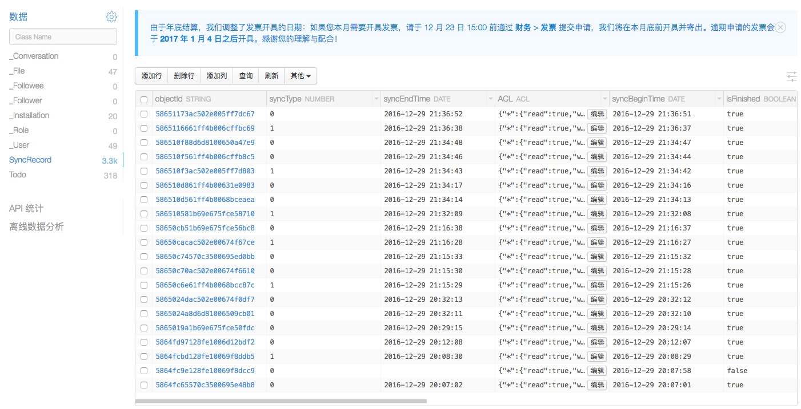

# TO-DO

## 简介
1. 这是一个无后端的待办事项应用，数据用LeanCloud进行同步，也是我的第三个 iOS 项目。
2. 做这个项目的初衷是想比较全面地体现我的前后端水平，该同步算法从整理思路到实现95%的代码（意为接近稳定）花了两周时间，除思路外没有任何代码可以参考（反正我是没有找到...
3. 界面设计来源于 [DO](https://www.invisionapp.com/do) ，部分素材和界面为本人设计。
4. 该项目于 2016-12-29 日第一版开发完成，之前由于意外收录可能有些朋友 clone 的是不稳定版，还请重新下载一次。

## 项目演示
一共6张GIF，共9M，请耐心等待。

 
 
 

## 测试服务器
为了方便大家观察服务器的数据，测试账号已公开，要是有什么情况请通知我，（当然万一发生了类似超额的情况我不一定会解决），另一方面会这样做的主要原因是自己搭建的话可能比较麻烦。

>注：从2016年12月31日起，该项目中的所有的**第三方API Key**已经换成测试账号中的新秘钥，且之前的 API Key 都被**弃用**。

#### LeanCloud 账号
siegrain@qq.com

Abcd123!@#

#### 七牛账号（存放头像）
sgtodo@126.com

Abcd123!@#

#### 高德
高德 Key 要 BundleID，请各位自行配置，不用地图也一样。

## 自己搭建
该项目一共接入了三个第三方服务，分别为七牛、LeanCloud 和高德地图，对应的 API Key 各位请向服务商申请，然后在 `SGAPIKeys.h` 中进行配置。

除此之外，LeanCloud 的配置请参考 [TO-DO 的 LeanCloud 配置指南](https://github.com/Seanwong933/TO-DO/blob/master/Docs/TO-DO%20%E7%9A%84%20LeanCloud%20%E9%85%8D%E7%BD%AE%E6%8C%87%E5%8D%97.md) ，这是必需的，毕竟 LeanCloud 的 SDK 没有提供类似事务的功能。

## 同步算法、思路等
如果你对这个感兴趣的话，请查看以下内容，并对照相应代码进行理解。

相关代码位于 `SGSyncManager.m` 和配置于 LeanCloud 云函数中的 nodejs 代码。

### 思路来源
该同步思路来源于以下两篇回答，并根据项目需求总结而来。

[服务端和各种客户端（手机端，平板端，web端）怎样进行数据同步？](https://www.zhihu.com/question/20754172)

[Evernote 的同步方式是怎样的？](https://www.zhihu.com/question/20238731)

### 同步方式
每一批次两个并行队列，每次最多同步X条数据，超过X条下次进行同步。

每批同步分上传和下载（与队列不对应），若上传或下载数超过上限，则下一批次同步。

### 同步类型
1. 若本地没有同步记录，则将本地所有数据进行上传，并将服务器上所有的数据进行下载（Incremental Sync）
2. 若 `lastSyncTimeOnServer = lastSyncTimeOnClient`，表明服务器数据没有变化，则仅需要上传本地修改过的数据和新增的数据（Send Changes）
3. 若 `lastSyncTimeOnServer > lastSyncTimeOnClient`，则进行全量同步，先对比同步所有已有数据，再将其他数据从服务器上下载(Full Sync)
4. 其他情况进行（Incremental Sync）

### 注意事项
1. 所有同步时间戳均以服务器时间为准，每次同步之前先获取服务器的时间戳
2. 对比同步规则：1.大版本同步小版本 2.版本相同的话，以线上数据为准进行覆盖（另一种做法是建立冲突副本，根据本项目的实际情况不采用这种方式）

### 异常情况
以下几种情况会影响同步时数据的原子性：

1. 云函数返回之前挂掉：下次同步则为full sync，同时在对比时会将objectId赋值给本地对应的待办事项。
2. 若在批次之间挂掉的话（上一批成功，下一批挂掉），这时需要在判断同步类型时，判断上一次同步成功的记录次数，若次数超限，此次同步为full sync。

### 同步难点
1. 处理各种异常情况，保证数据的一致性和原子性
2. 同步效率
3. 分批同步

### 同步流程

## 同步稳定性
从我大致写好同步功能（2016-6-20）到今天（2016-12-30）一共产生了3300条同步记录，暂时没有发现数据错误的地方，如果各位发现这方面有什么问题和Bug请一定提交 issue，非常感谢。

同步记录截图：

## License
TO-DO is available under the MIT license. See the LICENSE file for more info.
